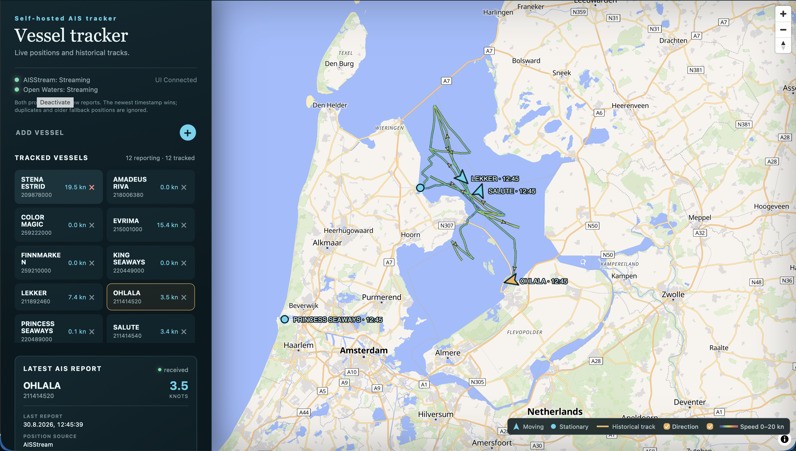

# AIS Track Archive

A local, self-hosted, AI-assisted AIS playground using AISStream and Open Waters, FastAPI, PostgreSQL/PostGIS, React, and MapLibre. Live vessel positions are merged by original observation time; historical positions are retained at most once per vessel every minute by default.

The repository contains no hosted instance and no collected AIS or database data. Anyone cloning it runs and configures their own local installation. It is not a navigational aid or a production-ready public service.

The development basemap uses OpenFreeMap's detailed Liberty vector style with OpenStreetMap data. Map attribution is supplied by the style automatically.

### Motivation

Example of the deployed vessel tracker app.



## Run it

Requirements: Git and Docker with Docker Compose.

Create a local configuration, add your AISStream key, and start the stack:

```sh
cp .env.example .env
# edit .env
docker compose up --build -d
```

Open <http://localhost:8000>. Add vessels in the interface; the public seed list is intentionally empty.

Useful checks:

```sh
docker compose ps
docker compose logs -f app
curl http://localhost:8000/api/v1/status
```

From a Mac, a Pi status report (containers, API/stream state, host resources, database size, table sizes, and estimated row counts) is available with:

```sh
./scripts/status-pi.sh
```

The report also includes a compact position-report breakdown by provider and source.

To create a compressed logical backup on the Mac while PostgreSQL keeps running:

```sh
./scripts/backup-db-pi.sh
```

The script uses `PI_HOST` and `PI_DIR` from `.env` and writes the dump to `./backups/`. Backup files are ignored by Git.

To deploy the ARMv7 build from the Mac, set `PI_HOST` and `PI_DIR` in the local `.env`, create the remote `.env` with the API keys, then run:

```sh
./scripts/deploy-pi.sh
```

The script creates the remote project directory and synchronizes the application, database build files, `compose.yaml`, and the ARM override. The override puts Adminer behind the `adminer` profile, so the normal Pi deployment builds and starts only the app and database. A new Pi still needs SSH access, `rsync`, Docker Compose, and permission to use Docker; the script intentionally never copies `.env`.

Stop the containers while preserving the database:

```sh
docker compose down
```

Do not use `docker compose down -v` unless you intentionally want to delete all locally stored history.

## Configuration

Keep the AISStream key only in `.env`:

```dotenv
AISSTREAM_API_KEY=your-key
HISTORY_SAMPLE_SECONDS=60
TRACK_GAP_MINUTES=45
TRIP_GAP_HOURS=6
AISSTREAM_MAX_MMSIS=50
OPENWATERS_ENABLED=true
OPENWATERS_MAX_MMSIS=10
```

Open Waters supports an anonymous subscription of up to 10 MMSIs. To use a personal token (up to 50 MMSIs), set `OPENWATERS_API_KEY` and change `OPENWATERS_MAX_MMSIS` to `50`. `.env` is excluded from both Git and the Docker build context.

`config/vessels.json` is an empty optional seed list. PostgreSQL becomes authoritative after startup. Adding or deactivating a vessel in the webpage updates the database and replaces the single upstream AISStream subscription; deactivation preserves existing history.

## Data behavior

- AISStream and Open Waters are live WebSocket sources and do not backfill this database. History starts with the first report received while an MMSI is active.
- Open Waters reports, including reports relayed from AISStream, are accepted only when their original event timestamp is newer than the current merged position. This lets Open Waters fill gaps while rejecting duplicates and older reports.
- Position history and the current vessel projection retain the provider, original source, and source station for provenance.
- Every valid live report is pushed to connected browsers immediately.
- Historical storage is sampled independently, per MMSI, using `HISTORY_SAMPLE_SECONDS`.
- Track intervals longer than `TRACK_GAP_MINUTES` are marked as observation gaps with a dashed dark border; the orange track, speed coloring, and direction arrows remain unchanged.
- PostgreSQL writes are batched, and monthly PostGIS partitions are created automatically.
- Vessel names are learned opportunistically from AIS metadata/static reports. The MMSI is shown until a name arrives.
- Current “trip” results are explicitly provisional segments separated by six-hour observation gaps. Port-based trip boundaries are not implemented yet.

The PostgreSQL data lives in the Docker named volume `ais_postgres_data`. It survives ordinary container rebuilds and restarts, but it is not a backup. Before the history matters, add automated off-machine backups and move the collector to an always-on 64-bit host.

## API

- `GET /healthz` and `GET /readyz`
- `GET /api/v1/status`
- `GET /api/v1/vessels`
- `GET|POST /api/v1/tracked-vessels`
- `DELETE /api/v1/tracked-vessels/{mmsi}`
- `GET /api/v1/vessels/{mmsi}/positions`
- `GET /api/v1/vessels/{mmsi}/trips`
- `WS /ws/v1/vessels`
- Interactive API documentation at <http://localhost:8000/docs>

Historical-position responses include a PostGIS-simplified track plus adjacent GeoJSON segment features. Each segment carries nested start/end AIS fields and an average `speed_knots` value for optional speed-based map coloring.

## Data and licensing

Copyright © 2026 Daniel Becker. The application source code is available under the [MIT License](LICENSE).

Runtime AIS and map data are supplied by third parties and are not relicensed by this repository. See [DATA_SOURCES.md](DATA_SOURCES.md) for attribution and usage notes. See [SECURITY.md](SECURITY.md) before running the app outside a trusted local network.
